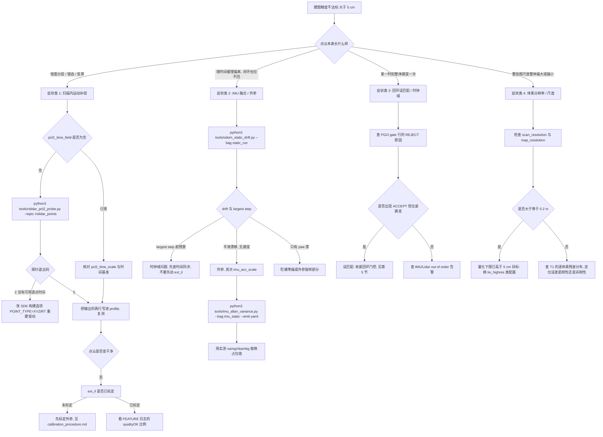

# 调参与排查清单（T2.1 部署）

> 适用平台：Orin NX + 速腾聚创 Airy/Odin1 + 四足机器狗。
> 相关文档：[硬件部署指南](hardware_deployment.md)、[标定流程](calibration_procedure.md)、
> [四足适配说明](quadruped_adaptation.md)、[测试场景与统计口径](test_scenarios.md)、
> [时间同步说明](../src/sensing/fastlio2/config/TIME_SYNC_NOTES.md)。

---

## 0. 诚实声明（先读这一节）

> **本文档里出现的每一个数字，只可能是下面三类之一，没有第四类。**
>
> | 类别 | 含义 | 可信度 |
> |:---|:---|:---|
> | **(a) 代码默认值** | 直接来自 `src/sensing/fastlio2/src/map_builder/commons.h` 的结构体初值、`lio_node.cpp` 的缺键回退、`ieskf.cpp` 的静态成员初值。可 grep 复核。 | 高（源码事实） |
> | **(b) 冻结合成仿真值** | 来自仓库自带的纯 Python 合成数据管线（`simulation/`），**不是硬件测量**。 | 中（同一仿真内可复现） |
> | **(c) 建议区间** | 本文给出的"推荐区间"，由代码量纲推导 + 工程经验给出，**必须在目标机器人上确认**。 | 低（待实测） |
>
> **本仓库没有任何一个参数是在目标机器人上实测得到的。**
> 没有 Airy/Odin1 驱动、没有目标 bag、没有板端运行记录。
> 因此：
>
> 1. **不得**把本文的"推荐区间"当成"已标定值"写进验收文档或生产配置；
> 2. **不得**把第 4 节表格里的任何一格当作精度承诺；
> 3. 凡是标注 **待实测** 的格，必须由括号里指名的工具在目标平台上产出；
> 4. 仿真指标（T1/T2/T3）只能证明"这套代码在合成场景里跑得通"，
>    **不能**外推到速腾雷达、Orin NX 或四足底盘。

### 0.1 本文引用的冻结仿真指标（类别 b）

| 指标 | 数值 | 口径 |
|:---|:---|:---|
| T1 建图精度（基线配置） | **0.02768 m**，95% CI [0.02712, 0.02825] | 合成场景，点对面 RMSE |
| T1 留出集 | **0.02991 m** | 同上，留出路径 |
| T2 单帧时延 | p50 **26.1 ms** / p95 **48.6 ms** / p99 **62.3 ms**（10 Hz 下） | 宿主 CPU，非 Orin |
| T2 丢帧 | **0%** | 同一运行 |
| T3 发布戳 ATE | **0.0181 m** | `/robot_pose_map` 按自身戳评分 |
| T3 当前时钟 ATE | 最高 **0.1878 m** | 订阅者按自己的时钟取位姿 |
| T3 可用率 | 全段 **88.58%**，锁定后 **99.53%** | 含启动段 |

> 这些数字**随每次运行波动**（同一份代码、同一个 bag 的重复运行有可观测的 run-to-run 离散）。
> 引用时必须连同运行目录一起引用，不要把某个具体数值当成常量阈值。

### 0.2 量纲陷阱（历史 bug 的高发区）

| 量 | 单位 | 易错点 |
|:---|:---|:---|
| `point_quality_thresh` | **无量纲评分 s** | **不是米**。同一函数里的 `esti_plane(points_near, 0.1, ...)` 的 `0.1` 才是距离 [m]（`lidar_processor.cpp:250`）。 |
| `move_thresh` | **倍率** | 与 `det_range` 相乘才是米（`lidar_processor.cpp:50`）。 |
| `pcl2_time_scale` | 到**秒**的换算系数 | 纳秒时间戳填 `1e-9`，不是 `1e9`。 |
| `imu_acc_scale` | **乘性增益** | 不是单位换算表；IMU 已输出 m/s² 时必须为 `1.0`。 |
| `na` / `ng` / `nba` / `nbg` | **源码与 YAML 均未标注** | 不得写成 `(m/s²)²` 之类的离散方差；`P += G·Q·Gᵀ` 只证明存在 `dt` 幂次缩放。 |
| `localizer` 的 `*_score_thresh` | **m²**（平均平方最近邻距离） | 物理上限是 `*_max_corr_dist²`；超过上限的门限恒真、失去意义。 |

---

## 1. 快速诊断决策树（"建图精度 > 5 cm"）

先按**症状**分流，再进入第 2 节对应的排查小节。**不要**在没有确定症状类别之前调 IMU 噪声权重——
那是最常见的无效操作。



**分流判据一句话版**：

| 症状 | 首选嫌疑 | 第一件事 |
|:---|:---|:---|
| 点云分层 / 锯齿 | `pcl2_time_field` 为空 | 跑 `rslidar_pcl2_probe.py` |
| 渐进漂移 | `ext_il` 未标定 | 跑 `odom_static_drift.py` 区分时钟 / 外参 |
| 突变跳变 | 时钟域不同 | 查 `out of order` 告警与 PGO 回环日志 |
| 全局尺度错 | 体素分辨率量化下限 | 比对 `scan_resolution` / `map_resolution` 与目标精度 |

---

## 2. 症状 → 排查顺序 → 参数

### 2.1 点云分层 / 锯齿

**物理原因**：一帧扫描耗时约 0.1 s（10 Hz），机体在这 0.1 s 内已经转动。
若不做扫描内去畸变，同一面墙在不同方位角的点会被投到不同位置，表现为分层或锯齿。
四足平台的俯仰/侧滚振荡会把该误差放大到肉眼可见。

| 顺序 | 检查项 | 命令 / 观察点 | 判据 | 不通过时改什么 |
|:---:|:---|:---|:---|:---|
| 1 | `pcl2_time_field` 是否为空 | `grep pcl2_time_field src/sensing/fastlio2/config/lio_orin_nx.yaml` | 出厂值为 `""` ⇒ **完全没有扫描内补偿** | 进入第 2 步 |
| 2 | 实测逐点时间字段 | `python3 tools/rslidar_pcl2_probe.py --topic /rslidar_points --once`<br>离线：`python3 tools/rslidar_pcl2_probe.py --bag walk.db3 --topic /rslidar_points --emit-yaml` | 退出码 0 = 找到可用字段；**退出码 2 = 不存在可用逐点时间字段**（这是真实答案，不是工具故障） | 退出码 2 ⇒ 重建驱动 SDK（见下） |
| 3 | 写入并核对换算 | 把探针输出的两行填进 profile，再跑 `python3 tools/preflight_config.py --config src/sensing/fastlio2/config/lio_orin_nx.yaml` | preflight 退出码 0 | 退出码 2 说明时间字段/换算仍被拒 |
| 4 | `ext_il` 是否已标定 | `grep ext_il src/sensing/fastlio2/config/lio_orin_nx.yaml`；启动日志是否出现 `Missing or invalid ext_il parameter, using defaults` | 出现该 WARN ⇒ 当前跑的是 `r_il=I, t_il=0` 的占位外参 | 先标定外参，见 [标定流程](calibration_procedure.md) |
| 5 | 有效点比例 | 日志中每 100 次 loss 调用的 `FEATURE n=... neighborOK=... planeOK=... qualityOK=...` | `qualityOK` 占比过低（接近 0）会打印 `NO Effective Points!` | 下调 `point_quality_thresh` |

**关于"没有逐点时间字段"这个最可能的答案**：速腾官方 ROS 2 SDK `rslidar_sdk` 的**默认**
`POINT_TYPE=XYZI` 只发布 `x/y/z/intensity`，**根本没有逐点时间**；只有构建为 `POINT_TYPE=XYZIRT`
才会有 `timestamp`（`FLOAT64`）。所以正确动作是**改构建选项重建驱动**，而不是在 YAML 里编一个字段名——
写一个不存在的字段名与留空等价（`find_offset` 找不到即退化为 `curvature = 0`），却会让配置看起来"已填"。

```bash
# 1) 实测字段（不要猜名字）
python3 tools/rslidar_pcl2_probe.py --topic /rslidar_points --once
#    或对已录的包：
python3 tools/rslidar_pcl2_probe.py --bag walk.db3 --topic /rslidar_points --emit-yaml

# 2) 探针给出的两行形如（数值以实测为准，此处仅为格式示例）：
#    pcl2_time_field: "timestamp"
#    pcl2_time_scale: 1e-09

# 3) 写完立刻做静态校验
python3 tools/preflight_config.py --config src/sensing/fastlio2/config/lio_orin_nx.yaml
#    若确实要在静止平台上不做补偿，必须显式承认：
python3 tools/preflight_config.py --config src/sensing/fastlio2/config/lio_orin_nx.yaml --allow-no-time-field
```

**注意**：逐点时间解决的是**扫描内**畸变（0.1 s 量级）；LiDAR 与 IMU 的**时钟域**是另一个问题
（ms–s 量级），二者**不能互相替代**。详见 [时间同步说明](../src/sensing/fastlio2/config/TIME_SYNC_NOTES.md)。

### 2.2 渐进漂移（随时间缓慢偏离）

**物理原因**：外参平移/旋转误差、加速度计量纲错误、IMU 噪声权重与真实噪声不匹配。
表现为误差**单调增长**且**没有单帧跳变**。

| 顺序 | 检查项 | 命令 / 观察点 | 判据 | 不通过时改什么 |
|:---:|:---|:---|:---|:---|
| 1 | 静止漂移基线 | `python3 tools/odom_static_drift.py --bag static_run --topic /fastlio2/lio_odom` | 退出码 0 = 在预算内（默认 5 cm / 0.005 m·min⁻¹ / 单步 0.10 m / yaw 1.0°） | 退出码 2 ⇒ 按第 6 节归因 |
| 2 | 外参 `ext_il` | profile 是否写了 `ext_il`；启动是否 `Missing or invalid ext_il parameter, using defaults` | 缺键 ⇒ 恒等占位，**必然**产生与安装偏差成正比的漂移 | 标定后写入，见 [标定流程](calibration_procedure.md) |
| 3 | `imu_acc_scale` | 静止时比较加速度模长的均值与 9.81（启动日志 `IMU init: g=%.4f ... acc_mean=[...]`） | 模长应在 8.5–10.5 之间；若约 1.0 说明输出是 g，若约 10 说明需要 ×10 | 设 `imu_acc_scale: 1.0` 或 `10.0` |
| 4 | `na` / `ng` 是否来自实测 | `python3 tools/imu_allan_variance.py --bag imu_static --topic /imu/data --emit-yaml` | 退出码 0 且四个值都不是 `n/a` | 用实测值替换占位值 |
| 5 | 零偏随机游走 `nba` / `nbg` | 同上（`--emit-yaml` 一并输出） | 工具对不可辨识的随机游走会打印 `NOT IDENTIFIABLE` 并给 `n/a`——**这是正确答案** | 录制更长时间重跑，不要填一个编造值 |

```bash
# 静止录制（机器人通电但不动，>= 10 min；Allan 方差建议 6-12 h）
ros2 bag record /imu/data /fastlio2/lio_odom -o static_run

# 端到端漂移检查（不需要真值、不需要全站仪）
python3 tools/odom_static_drift.py --bag static_run --topic /fastlio2/lio_odom

# IMU 噪声标定（拒绝非静止数据，退出码 2）
python3 tools/imu_allan_variance.py --bag imu_static --topic /imu/data --emit-yaml
```

> `imu_allan_variance.py` 对**运动数据**会拒绝（退出码 2）；对随机游走交叉点超出录制长度的情形
> 会明确打印"不可辨识"。**两种都不是工具失败**，不要为了得到数字而放松输入条件。

### 2.3 突变跳变（某一帧后整体跳变）

**物理原因**：两类，必须先分清。

| 类别 | 特征 | 首要排查 |
|:---|:---|:---|
| **时钟域错** | 单步大跳变 + `IMU/Lidar Message is out of order` 告警 + 缓冲被清空 | 时间同步（不是外参） |
| **回环误匹配** | 跳变发生在 `[PGO][gate] ... ACCEPT` 之后 | PGO 门控（见第 5 节） |

| 顺序 | 检查项 | 命令 / 观察点 | 判据 | 不通过时改什么 |
|:---:|:---|:---|:---|:---|
| 1 | 单步跳变幅度 | `python3 tools/odom_static_drift.py --bag static_run` 输出 `largest step : X cm at t=...` | 超过 `--max-jump-m`（默认 0.10 m） | 判为时钟问题，进入第 2 步 |
| 2 | 乱序告警 | 启动日志中的 `IMU Message is out of order` / `Lidar Message is out of order` | 出现即说明两条流不在同一时间轴（`lio_node.cpp` 的 `imuCB`/`lidarCB`：`timestamp < last` 即 `swap()` 掉整个缓冲） | 让 LiDAR/IMU 进入同一时间轴；回放 bag 时必须 `--clock` |
| 3 | 回放是否用了仿真时钟 | `ros2 bag play <bag> --clock` | 不加 `--clock` 时 bag 时间与系统时间不同域 | 加 `--clock` |
| 4 | PGO 是否在跳变时刻接受过回环 | 日志 `[PGO][gate]` 行末尾的 `ACCEPT` / `REJECT(...)` 与 `seeds=[...]` | 跳变时刻是否有 `ACCEPT` | 有 ⇒ 转第 5 节 |
| 5 | 是否真的跳变而非累积 | `[PGO][gate]` 行的 `rel_t=` 与 `corr=`（`corr` 超过 `(max ...)` 即被 `correction` 门拒绝） | `corr` 应远小于允许上限 | 见第 5 节 |

### 2.4 静止不动却漂移

**这是最便宜、信息量最大的单项测试**，不需要真值、不需要运动、不需要全站仪。

```bash
# 机器人通电静置 >= 10 min，录制里程计（也可用仿真写出的 TUM 文件）
ros2 bag record /fastlio2/lio_odom -o static_run
python3 tools/odom_static_drift.py --bag static_run --topic /fastlio2/lio_odom

# 已有 TUM / npz 时
python3 tools/odom_static_drift.py --tum odom.tum
python3 tools/odom_static_drift.py --npz static.npz

# 收紧预算（严格验收）
python3 tools/odom_static_drift.py --bag static_run \
    --max-drift-m 0.05 --max-drift-per-min 0.005 --max-jump-m 0.10 --max-yaw-deg 1.0
```

| 输出字段 | 含义 | 超标指向 |
|:---|:---|:---|
| `drift` | 末位姿相对前 10 s 均值的位移 | 外参 / 量纲 / 噪声权重 |
| `drift rate` | 漂移速率 cm/min、cm/h | 同上（与录制长度无关） |
| `yaw drift` | 总偏航漂移（度） | 陀螺零偏或外参旋转部分 |
| `largest step` | 最大单样本跳变及其时刻 | **时钟域** |
| `path length` | 累积路径长度（真静止应约 0） | 噪声底 / 抖动 |

退出码：**0 = 在预算内，2 = 超预算，1 = 输入读不了**。

### 2.5 建图精度不达标但点云看着正常

**首要嫌疑是量化下限，而不是估计器**。

| 参数 | 代码里的作用 | 后果 |
|:---|:---|:---|
| `scan_resolution` | 单帧 VoxelGrid 叶尺寸（`lidar_processor.cpp:18` `setLeafSize`，`:181-182` `filter`） | 决定发布为 body cloud 并并入地图的点的**间距**，直接限制可达地图分辨率 |
| `map_resolution` | ikd-Tree 盒滤波体素（`lidar_processor.cpp:7` `set_downsample_param`）＋地图点体素质心化步长（`lidar_processor.cpp:135-137`） | 地图点被量化到该尺寸的网格上 |

**结论（代码推导，高置信）**：`lio_orin_nx.yaml` 出厂值 `scan_resolution: 0.3` / `map_resolution: 0.3`
把地图点量化到 **0.3 m 网格**，这个量化下限本身就已经**一个数量级高于 5 cm 目标**，
因此在该配置下**任何亚分米级的精度主张都不成立**——无论估计器多准。

| 顺序 | 检查项 | 判据 | 动作 |
|:---:|:---|:---|:---|
| 1 | `scan_resolution` / `map_resolution` | 是否 ≥ 0.2 m | 是 ⇒ 换 `config/lio_highres.yaml` 一类配置（0.05 m 量级） |
| 2 | 代价评估 | 地图点数约随 `1/r²` 增长 | 0.3 → 0.05 是 6× 更细的网格 ⇒ 约 36× 地图点、GB 级内存增长（**由缩放推断，本仓库未实测**） |
| 3 | 逐体素残差分布 | T1 的 `--stat-voxel` 输出 | 残差是否呈**量化台阶**（离散化伪影）还是**平滑分布**（估计误差） |
| 4 | 刚性 vs 非刚性 | 仿真口径：额外一次刚性 SE(3) 重拟合后的 RMSE 变化 | 变化大 ⇒ 坐标链/规范（gauge）问题；变化小 ⇒ 地图内部形变 |

```bash
# 建图指标评测（仿真口径）
python3 simulation/scripts/test_t1_accuracy.py --run-dir /tmp/sim_map --ref-dir /tmp/sim_ref
python3 simulation/scripts/test_t1_accuracy.py --run-dir /tmp/sim_map --ref-dir /tmp/sim_ref \
    --threshold-m 0.05 --stat-voxel 0.05
```

### 2.6 定位可用率低 / 启动慢

| 现象 | 代码位置 / 观察点 | 参数 | 方向 |
|:---|:---|:---|:---|
| 启动后长时间不出位姿 | 日志 `localization lock adopted at t=[...]` 出现的时刻 | `gate_recovery_accepts`（默认 10） | 降低会更快出位姿，但会放行未经验证的锁 |
| 频繁 `ICP update rejected by outlier gate` | 同日志，含 `innovation=%.3fm %.3frad (%d consecutive)` | `gate_max_translation_m` / `gate_max_angle_rad` | 门限过紧会把真实运动判成跳变 |
| 反复 `declaring the localization INVALID` | 日志 `outlier gate: %d consecutive ICP updates rejected; ...` | `gate_max_consecutive_rejects`（默认 10） | 提高可容忍更长遮挡，但会延长失效检测 |
| 恢复慢 | 日志 `localization lock recovered after %d consecutive accepted ICP updates (valid again)` | `gate_recovery_accepts`（默认 10） | 降低可更快复锁 |
| 配准本身失败 | `rough_score_thresh` / `refine_score_thresh` | 见第 4 节定位表 | 门限超过 `*_max_corr_dist²` 时恒真、失去意义 |
| 更新率上不去 | 日志 `correspondence: rough ... refine ...` 与 `gate: ...`、`validity timeout ...s report ...s` | `refine_max_iteration` | 降低迭代数可提速（仓库记录：15 → 8 使 refine 阶段耗时减半，精度无损失，属**该序列上的实测**，换平台需复测） |

```bash
# 定位评测（含可用率）
python3 simulation/scripts/test_t3_localization.py --run-dir /tmp/sim_loc --ref-dir /tmp/sim_ref
python3 simulation/scripts/test_t3_localization.py --run-dir /tmp/sim_loc --ref-dir /tmp/sim_ref \
    --min-availability 0.95 --min-post-lock-availability 0.95
```

**启动段必须单独报告**：冻结仿真里全段可用率 88.58%、锁定后 99.53%。
两者的差额来自 IMU 初始化 + 首次锁定，是**启动段固有代价**，不是定位器精度问题。
引用可用率时必须写清分母（全段 / 锁定后）。

### 2.7 退化场景（长走廊、隧道、玻璃、空旷）

**代码现状（必须如实说明）**：前端 `fastlio2` **没有**退化检测。
`lidar_processor.cpp` 的 `updateLossFunc` 只做点面残差与质量门限，不检查
`H = Σ nᵢnᵢᵀ` 的条件数。退化时 IESKF 会在几何无约束的方向上自由滑动，
**不会**报错，只会安静地漂。PGO 侧有 `degeneracy_gate_enabled` / `degeneracy_min_eig_ratio`
（默认 `true` / `0.003`），但它只作用于**回环候选**，不影响前端里程计。

| 场景 | 物理表现 | 影响 | 缓解手段 |
|:---|:---|:---|:---|
| 长走廊 / 隧道 | 两侧墙法向均垂直于走廊轴 ⇒ 沿轴不可观测 | 沿轴漂移，且无告警 | 依赖 IMU 短时约束 + 回环；必须实测，本仓库**未验证** |
| 玻璃 / 镜面 | 回波缺失或虚点 | 有效点骤减 ⇒ `qualityOK` 低 ⇒ 可能 `NO Effective Points!` | 下调 `point_quality_thresh`；物理遮挡 |
| 空旷（少结构） | 邻域点数不足 | `neighborOK` 低，平面拟合失败 | 下调 `point_quality_thresh`；接受该帧无观测（IESKF 会保留传播值） |
| 动态物体 | 人/其它机器人进入点云 | 被当作静态地图，回环误匹配风险上升 | 无内置处理，需外部 ROI 或人工清场 |

| 顺序 | 检查项 | 命令 / 观察点 | 判据 |
|:---:|:---|:---|:---|
| 1 | 有效点是否塌陷 | `FEATURE n=... neighborOK=... planeOK=... qualityOK=...` | `qualityOK/n` 明显低于正常路段 |
| 2 | 是否整帧无观测 | stderr `NO Effective Points!` | 出现频繁 ⇒ 门限过严 |
| 3 | IESKF 是否在空转 | stderr `[ieskf] updates=... rejected=...` | `rejected` 增长 ⇒ 求解不健康 |
| 4 | 回环是否被退化门拒绝 | `[PGO][gate]` 行的 `REJECT(... degenerate ...)` 与 `eig=[...] ratio=... (min ...)` | `ratio` 低于 `degeneracy_min_eig_ratio` |

### 2.8 四足步态导致精度差

**前置条件：在做完 2.1（扫描内补偿）之前，不要开步态滤波。**
若扫描内补偿本身没工作，陷波只会让问题更难定位。

| 顺序 | 检查项 | 命令 | 判据 |
|:---:|:---|:---|:---|
| 1 | 扫描内补偿已生效 | `python3 tools/rslidar_pcl2_probe.py --topic /rslidar_points --once` | 退出码 0，且 profile 已填 |
| 2 | 步态基频与谐波 | `python3 tools/imu_gait_spectrum.py --bag walk_imu --topic /imu/data --emit-yaml --plot gait.png` | 退出码 0 且有**谐波结构**（真实步态是周期运动）；**退出码 2 = 未发现周期步态，此时保持 `gait_filter_enable: false` 才是正确结果** |
| 3 | IMU 采样率与配置一致 | `ros2 topic hz /imu/data` | 必须等于 `gait_filter_sample_rate_hz`（默认 200.0），否则陷波中心频率无意义 |
| 4 | 滤波是否真的装上 | 启动日志 `Gait filter ACTIVE: ...` 或 `Gait filter requested but NOT installed ... IMU path is unmodified.` | 看到 `NOT installed` ⇒ **滤波没有运行**，不要假设它生效 |
| 5 | 群延迟是否已知 | 同 `Gait filter ACTIVE` 行末尾 `group delay at 5 Hz = X ms` | 陀螺与加速度计只滤一侧时会打印相对时偏告警 |
| 6 | A/B 验证 | 同一段 bag 回放两次（关 / 开），比较 T1、T2 | 见下 |

> **⚠️ 步态滤波的收益在本仓库的数据上是"未测量"的。**
> 本仓库从未录过这台机器狗走路，因此没有任何证据表明开启它能提升精度。
> 评审报告里 `[15, 20, 25] Hz` 一类的示例是**示意值，不是测量值**。
> 必须做 A/B：同一段包、同一配置，只切换 `gait_filter_enable`，
> 验收要求是 **B 不差于 A**。若 B 变差，说明陷波打到了真实运动 —— 降低 `gait_notch_q`
> 或去掉谐波节。**不得**在验收文档里写"补偿后精度提升 X%"这类未验证的结论。

```bash
# 步态频率提取（直线行走，常速，>= 30 s，建议 60 s）
ros2 bag record /imu/data -o walk_imu
python3 tools/imu_gait_spectrum.py --bag walk_imu --topic /imu/data --emit-yaml --plot gait.png

# A/B：A 关、B 开，同一段包回放，比较 T1/T2
python3 simulation/scripts/test_t1_accuracy.py --run-dir /tmp/sim_A --ref-dir /tmp/sim_ref
python3 simulation/scripts/test_t2_speed.py     --run-dir /tmp/sim_A
```

---

## 3. 关键参数推荐区间表

**读法**：`代码默认值` = `commons.h` 结构体初值 / `lio_node.cpp` 缺键回退 / `ieskf.cpp` 静态初值。
`lio_orin_nx.yaml 当前值` = 出厂部署 profile 实际写入值（**未在板端验证**）。
`推荐区间` 属**类别 (c)：必须在目标平台确认**。

### 3.1 几何 / 分辨率 / 局部地图

| 参数 | 物理含义 | 单位 | 代码默认值 | `lio_orin_nx.yaml` 当前值 | 推荐区间 | 调整方向与代价 |
|:---|:---|:---:|:---:|:---:|:---|:---|
| `scan_resolution` | 单帧 VoxelGrid 叶尺寸（发布 body cloud 的间距） | m | `0.15` | `0.3` | **0.05–0.15**（5 cm 级精度必须）；0.3 只适用于粗建图 | 变细 ⇒ 点数上升、单帧残差/雅可比成本上升、地图变大。**0.3 是结构性障碍，不是调优项** |
| `map_resolution` | ikd-Tree 盒滤波体素 + 地图点体素质心化步长 | m | `0.3` | `0.3` | **0.05–0.15**（5 cm 级精度必须） | 变细 ⇒ 地图点数约按 `1/r²` 增长（0.3→0.05 约 36×），内存与 kNN 成本上升（**由缩放推断，未实测**） |
| `cube_len` | 局部地图立方体边长 | m | `300` | `200.0` | 室内 **100–500**；必须满足 `cube_len > 2·move_thresh·det_range` | 变大 ⇒ 常驻地图点变多、内存与 kNN 成本上升；变小 ⇒ 滑动裁剪更频繁，边界处地图点被反复删建 |
| `det_range` | 局部地图滑动检测半径 | m | `60` | `30.0` | **≥ `lidar_max_range`**，室内 30–100 | 变大 ⇒ 局部地图更大、更贵；变小 ⇒ 传感器量程内的点进图即被裁掉（当前 `det_range == lidar_max_range == 30.0`，取等号，任一上调都必须同步另一项） |
| `move_thresh` | 触发滑动的边界倍率（`det_thresh = move_thresh·det_range`） | 倍率 | `1.5` | `1.5` | **1.2–2.0** | 变大 ⇒ 裁剪更晚、更省 CPU，但边界余量小；变小 ⇒ 更频繁滑动。与 `cube_len`、`det_range` 三者必须满足上面的不等式 |

### 3.2 距离 / 抽稀

| 参数 | 物理含义 | 单位 | 代码默认值 | `lio_orin_nx.yaml` 当前值 | 推荐区间 | 调整方向与代价 |
|:---|:---|:---:|:---:|:---:|:---|:---|
| `lidar_filter_num` | 原始点抽稀步长（每 N 取 1） | 点 | `3` | `2` | **1–3**（PointCloud2 路径另受 `pcl2_filter_phase` 影响） | 变小 ⇒ 点数成倍上升、CPU 上升、精度可能改善；变大 ⇒ 省 CPU 但稀疏处平面拟合失败率上升 |
| `lidar_min_range` | 最近有效距离（`\|p\|² < min²` 丢弃） | m | `0.5` | `0.5` | **≥ 雷达盲区且 ≥ 机体自身外形**，0.3–1.0 | 设小了 ⇒ 拍到自身腿/壳体，被当成静态地图（四足平台尤其危险） |
| `lidar_max_range` | 最远有效距离（`\|p\|² > max²` 丢弃） | m | `20.0` | `30.0` | **≤ `det_range` 且 ≤ 雷达有效量程**，20–50 | 设大了而 `det_range` 未同步 ⇒ 远端点进图即被裁；设小了 ⇒ 丢失远距离约束，长走廊更易漂 |

### 3.3 IMU 噪声 / 初始化

| 参数 | 物理含义 | 单位 | 代码默认值 | `lio_orin_nx.yaml` 当前值 | 推荐区间 | 调整方向与代价 |
|:---|:---|:---:|:---:|:---:|:---|:---|
| `na` | 加速度计白噪声（写入 `Q(3,3)`，`imu_processor.cpp:14`） | 源码未标注 | `0.01` | `0.1` | **待实测** → `python3 tools/imu_allan_variance.py --bag imu_static --emit-yaml` | 变大 ⇒ 更信 LiDAR、更不信 IMU；过大会在退化场景里丢掉 IMU 的短时约束。当前值是从另一套传感器配置抄来的，**不是 Airy 的标定结果** |
| `ng` | 陀螺白噪声（`Q(0,0)`） | 源码未标注 | `0.01` | `0.01` | **待实测** → 同上 | 同上。四足平台真实振动高于静态 Allan 结果，静态标定**偏乐观** |
| `nba` | 加速度计零偏随机游走（`Q(9,9)`） | 源码未标注 | `0.0001` | `0.0001` | **待实测** → 同上；不可辨识时工具给 `n/a` | 变大 ⇒ 允许 `ba` 更快变化；过大会让重力被零偏吸收 |
| `nbg` | 陀螺零偏随机游走（`Q(6,6)`） | 源码未标注 | `0.0001` | `0.0001` | **待实测** → 同上 | 同上；`nbg` 过大是 yaw 慢漂的常见来源 |
| `imu_acc_scale` | 加速度**乘性**增益（`imuCB` 里直接相乘） | 增益 | `10.0` | `1.0` | **`1.0`（IMU 输出 m/s²）或 `10.0`（输出约 g）**；判据：静止 `\|a\|` 均值 ≈ 9.81 | 设错就是 10× 量纲错误，直接表现为重力对齐失败与恒定加速度泄漏。**profile 里的 `1.0` 是假设值，必须实测** |
| `imu_init_num` | legacy 计数模式的最少缓存样本数 | 样本 | `20` | `40` | 40–200（`imu_init_window_s = 0` 时才是唯一判据） | 变大 ⇒ 启动更慢但零偏估计更稳；在静态窗模式下只作为最小样本门槛 |
| `imu_init_window_s` | 静止窗时长；`> 0` 才启用静窗判定 | s | `0.0`（关闭） | `3.0` | **2.0–5.0**（四足平台必须有真正的静止窗）；`0` = 关闭 | 变大 ⇒ 需要更长的静止期，启动变慢；变小 ⇒ 零偏取自更短的窗，方差更大。**注意 `lio_highres.yaml` 省略了该键 ⇒ 静默退回计数模式** |
| `imu_init_static_gyro_std` | 静窗判据：三轴陀螺标准差上限 | rad/s | `0.005` | `0.005` | **待实测** → 由静止段陀螺标准差导出（`tools/imu_allan_variance.py` 的静态性判据同源） | 过紧 ⇒ 永远判不出静止窗，每次都走超时回退并打印 `no static window within ...`；过松 ⇒ 把运动窗当成静止窗，零偏被污染 |
| `imu_init_static_acc_dev` | 静窗判据 & 重力采纳判据：相对窗均值的最大偏差 | m/s² | `0.3` | `0.3` | **0.1–0.5** | 同时门控 `gravity_align` 的实测重力采纳（还需 `8.5 < \|a\| < 10.5`）。过紧 ⇒ 不采纳实测重力，退化为 9.81 常数 |
| `imu_init_max_wait_s` | 最长等待；到点后**仅按时间**回退到"最安静窗" | s | `15.0` | `5.0` | **≥ `imu_init_window_s`**，5–30 | 设小了 ⇒ 快速回退（启动快），但零偏可能来自仍在运动的窗；设大了 ⇒ 四足平台可能等很久才起飞 |

### 3.4 估计器 / 门限 / 约束

| 参数 | 物理含义 | 单位 | 代码默认值 | `lio_orin_nx.yaml` 当前值 | 推荐区间 | 调整方向与代价 |
|:---|:---|:---:|:---:|:---:|:---|:---|
| `near_search_num` | 每次 kNN 近邻数（平面拟合与选点判据共用） | 点 | `5` | `5` | **5**（默认即合理）；4–10 | 变大 ⇒ 平面拟合更鲁棒、更抗噪，但 kNN 与拟合成本上升；变小 ⇒ 拟合不稳定 |
| `ieskf_max_iter` | IESKF 迭代上限 | 次 | `5` | `5` | **3–10** | 变大 ⇒ 精度略升、CPU 上升；代码另有停止判据（旋转 < 0.01°、平移 < 0.00015 m），通常提前退出 |
| `gravity_align` | `true` 时用实测 `\|a\|` 覆盖 `State::gravity` 并对齐重力方向 | 布尔 | `true` | `true` | **`true`** | 置 `false` ⇒ 只用 `-acc_mean` 定方向、不采纳幅值，9.81 与实际比力不匹配时会留下恒定加速度泄漏，由 `ba` 吸收 |
| `esti_il` | 是否让 `r_il/t_il` 成为滤波器状态（`lidar_processor.cpp:326-332` 才补 C/D 雅可比块） | 布尔 | `false` | `false` | **`false`**（结构性选择，见下） | **这是结构性选择不是调优项。** `true` 意味着外参变成 21 维状态的一部分：标定误差会被在线"补偿"进状态，并**泄漏进地图**——地图看起来自洽，但几何已被一个错误的外参形变。除非明确要做在线外参估计，否则保持 `false` |
| `point_quality_thresh` | 点面匹配质量评分门限，判据 `s > thresh`；`s = 1 - 0.9·\|pd2\|/sqrt(\|p_body\|)` | **无量纲**（不是米） | `0.1` | `0.9` | **0.1–0.9**；`0.1` = 宽松（默认），`0.9` = 上游 FAST-LIO2 值（严格） | 变大 ⇒ 只保留高质量匹配，稀疏场景会滤掉大半有效点并触发 `NO Effective Points!`；变小 ⇒ 更多点参与，抗差性下降。门限 ≥ 1 时**恒不通过**（`s ≤ 1`） |
| `lidar_cov_inv` | 点到面残差信息矩阵的标量权重（`H += Jᵀ·w·J`） | 无量纲权重 | `1000.0` | `1000.0` | **1e2–1e4**（相对权重，见第 4 节） | 单独乘常数在稳态下影响有限；真正决定 IMU/LiDAR 相对权重的是 `na/ng/nba/nbg` 与扫描周期 |
| `max_bias_gyro` | `bg` 逐轴硬截断 | rad/s | `0.1`（三处一致） | **未写** ⇒ 生效 `0.1` | **0.05–0.5**；必须大于真实零偏 | 设小了 ⇒ 真实零偏被截断，姿态持续偏移；设大了 ⇒ 失去保护，异常帧可以把 `bg` 推到荒谬值 |
| `max_bias_accel` | `ba` 逐轴硬截断 | m/s² | `0.2`（`commons.h:88`，**永不生效**） | **未写** ⇒ 生效 `0.5` | **0.1–1.0**；必须大于真实零偏与量纲残差 | 同上。**注意三处不一致**：`commons.h` = `0.2`、`ieskf.cpp:7` 静态初值 = `0.5`、`lio_node.cpp:319` 缺键回退 = `0.5`，实际生效 `0.5` |
| `max_velocity` | 速度硬截断 | m/s | `10.0` | **未写** ⇒ 生效 `10.0` | **≥ 2× 实际最大速度**；四足 0.5–1.5 m/s ⇒ 3–5 足够 | 设大了 ⇒ 失去保护，异常帧可把速度推到荒谬值；设小了 ⇒ 截断真实运动，快速段直接失准 |

### 3.5 步态滤波（`gait_*`，默认全关 = 惰性直通）

| 参数 | 物理含义 | 单位 | 代码默认值 | `lio_orin_nx.yaml` 当前值 | 推荐区间 | 调整方向与代价 |
|:---|:---|:---:|:---:|:---:|:---|:---|
| `gait_filter_enable` | 总开关；`false` 时滤波器完全惰性，IMU 通路与历史行为逐位一致 | 布尔 | `false` | `false` | **保持 `false` 直到第 2.8 节测出频率并完成 A/B** | 开启但 `gait_notch_freq_hz` 为空 ⇒ 启动打印 `RCLCPP_ERROR`，等于没开 |
| `gait_notch_freq_hz` | 陷波中心频率列表，每个频率一个二阶节 | Hz | 空 | **注释掉（空）** | **必须来自实测**：`python3 tools/imu_gait_spectrum.py --bag walk_imu --topic /imu/data --emit-yaml`；每个中心必须落在 `(0, Nyquist)` 内 | 填错频率**比不滤更糟**：删掉真实运动、留下步态振荡。超出 Nyquist 的频率被 `validate()` 拒绝并告警 |
| `gait_notch_q` | 品质因数（`> 0`）；-3 dB 带宽约 `f0/q` | 无量纲 | `10.0` | **注释掉（空）** | 由实测峰宽反推 `f0/带宽`，常见 **5–30** | 变大 ⇒ 陷波更窄、对真实运动影响更小，但对频率估计误差更敏感；变小 ⇒ 带宽过宽，会削掉真实运动 |
| `gait_filter_sample_rate_hz` | IMU 采样率，必须 `> 2·max(中心频率)` | Hz | `200.0` | `200.0` | **必须等于实测 IMU 频率**（`ros2 topic hz /imu/data`） | 填错 ⇒ 陷波中心落在错误的物理频率上，滤波等于无效或误伤 |
| `gait_filter_gyro_x` / `_y` / `_z` | 陀螺三轴掩码 | 布尔 | `true` / `true` / `false` | `true` / `true` / `false` | 默认即可：滤俯仰/侧滚，**不滤偏航** | 滤偏航会引入无谓相位滞后——步态不产生偏航振荡，而偏航是 LiDAR 唯一能直接观测的姿态分量 |
| `gait_filter_accel_x` / `_y` / `_z` | 加速度计三轴掩码 | 布尔 | `false` / `false` / `false` | `false` / `false` / `false` | 只在需要压制触地冲击时开启，且**与陀螺一起开/一起关** | 只滤一侧会引入相对群延迟（启动会打印具体 ms 数），破坏预积分依赖的时序对齐 |

---

## 4. 参数敏感性说明

**标注约定**：`[代码推导]` = 可从源码直接推出，高置信；`[经验]` = 工程规则，**需在硬件上确认**。

### 4.1 高杠杆（改了会明显改变结果）

| 参数 | 敏感性来源 | 等级 |
|:---|:---|:---|
| `scan_resolution` / `map_resolution` | 设定**硬量化下限**。地图点被量化到该尺寸网格（`lidar_processor.cpp:135-137`），扫描点被抽到该间距（`:18`）。量化误差不会随估计器变准而消失。 | `[代码推导]` **硬下限** |
| `na` / `ng` / `nba` / `nbg` | 写入 `m_Q`（`imu_processor.cpp:13-16`），经 `P += G·Q·Gᵀ`（`ieskf.cpp:98`）注入。它们直接设定 **IMU 与 LiDAR 的信任比**：`na/ng` 越大，滤波器越依赖 LiDAR 观测；越小，越依赖 IMU 传播。 | `[代码推导]` **高** |
| `ext_il` | 缺键时退回 `r_il=I, t_il=0`（`lio_node.cpp` 打印 `Missing or invalid ext_il parameter, using defaults`）。平移误差按杆臂 × 角速度直接进入点云配准残差；旋转误差则整体旋转地图。 | `[代码推导]` **高** |
| `pcl2_time_field` / `pcl2_time_scale` | 空字段 ⇒ `curvature = 0`（`utils.cpp:120`）⇒ **完全没有扫描内运动补偿**。运动平台上的误差与角速度 × 帧时长成正比。 | `[代码推导]` **高（开关式）** |
| `imu_acc_scale` | 乘性作用于 `imuCB`（`lio_node.cpp:356`）。设错即 10× 量纲错误。 | `[代码推导]` **高（开关式）** |

### 4.2 中杠杆

| 参数 | 敏感性来源 | 等级 |
|:---|:---|:---|
| `point_quality_thresh` | 门限就是评分 `s` 本身，判据 `s > thresh`（`lidar_processor.cpp:212,257`）。`s = 1 - 0.9·\|pd2\|/sqrt(\|p_body\|)`，**无量纲，不是距离**。上游 FAST-LIO2 用 `s > 0.9`。 | `[代码推导]` **中**：它决定"每帧有多少点参与观测"。过大 ⇒ 稀疏场景 `NO Effective Points!`，该帧无观测；过小 ⇒ 抗差性下降。 |
| `near_search_num` | 既是 kNN 近邻数，也是平面拟合与选点判据的共同门限（`lidar_processor.cpp:232,237,241`）。 | `[代码推导]` **中**：精度↔CPU 的直接权衡。 |
| `ieskf_max_iter` | 迭代上限（`ieskf.cpp:122`），但代码有停止判据：旋转 < 0.01°、平移 < 0.00015 m（`lidar_processor.cpp:26`）。 | `[代码推导]` **中**：多数帧提前退出，提高上限的边际收益递减。 |
| `cube_len` / `det_range` / `move_thresh` | 三者共同决定局部地图窗口与滑动步长（`lidar_processor.cpp:50,63`）。约束：`cube_len > 2·move_thresh·det_range`，否则 `mov_dist` 走回退分支。 | `[代码推导]` **中**：影响内存、kNN 成本与边界处的删建频率。 |
| `lidar_max_range` vs `det_range` | 若 `lidar_max_range > det_range`，传感器量程内的远端点进图即被裁掉。 | `[代码推导]` **中**：当前两者都取 30.0，任一改动必须同步。 |

### 4.3 低杠杆 / 结构性（不要指望靠调它提升精度）

| 参数 | 说明 | 等级 |
|:---|:---|:---|
| `lidar_cov_inv` | 只缩放 `share_data.H` 与 `b`（`lidar_processor.cpp:333-334`），而先验项 `Jᵀ P⁻¹ J` **不被它缩放**（`ieskf.cpp:143-147`）；同时每次 update 结束后 `m_P = L·H⁻¹·Lᵀ`（`ieskf.cpp:209`），即**后验协方差由同一次求解给出，绝对尺度在下一帧被重置**。因此在稳态下单独把 `lidar_cov_inv` 乘 10 与乘 0.1 的估计差异有限。真正决定 IMU/LiDAR 相对权重的是 `na/ng/nba/nbg`（写入 `m_Q`）与扫描周期 `dt`。 | `[代码推导]` 机制高置信；"稳态差异有限"`[经验]`，需实测确认 |
| `max_bias_gyro` / `max_bias_accel` / `max_velocity` | 都是**逐轴硬截断**（`ieskf.cpp:31-45`），只在状态越界时起作用。正常运行时它们是**安全网**，不是精度旋钮。 | `[代码推导]` **低**（除非真实零偏/速度确实越界） |
| `gravity_align` | 只影响初始化时 `State::gravity` 的取值与 `r_wi` 的初始对齐（`imu_processor.cpp:162-181`）。 | `[代码推导]` **低**（但设错会留下恒定加速度泄漏） |
| `esti_il` | **结构性选择**。`true` = 外参成为滤波器状态。标定误差会被在线"补偿"进状态并**泄漏进地图**：地图自洽但几何被形变。**建议保持 `false`**，除非明确要做在线外参估计。 | `[代码推导]` **结构性** |
| `gait_*` | 默认全关时惰性直通，与历史行为逐位一致。开启后的收益在本仓库数据上**未测量**。 | **未测量** |

### 4.4 三条容易踩的"看似调参实则结构错误"

1. **`scan_resolution: 0.3` + 声称 5 cm 精度** —— 量化下限已经高于目标，两者不能同时成立。
2. **`esti_il: true` + 未标定的 `ext_il`** —— 让滤波器去补偿一个未知的外参，误差进地图。
3. **开了 `gait_filter_enable` 但没填频率** —— 启动会 `RCLCPP_ERROR`，IMU 通路不变，
   但配置看起来"已启用"。以启动日志里的 `Gait filter ACTIVE` 为准。

---

## 5. 回环 / PGO 门控排查

PGO 采用 GTSAM iSAM2 + Scan Context，回环候选要穿过**两级配准 + 一组门控**才会成为因子。

### 5.1 门控清单与拒绝字符串

日志里 `REJECT(...)` 括号内的字符串**就是**失败的门控名（源码 `loop_closure.cpp` 与 `simple_pgo.cpp`）：

| 阶段 | 拒绝字符串 | 含义 | 相关参数 |
|:---|:---|:---|:---|
| 粗配准 | `empty_input` | 源/目标子图为空 | `loop_submap_half_range` / `loop_source_submap_half_range` |
| 粗配准 | `coarse_rmse` | 粗配准全点 RMS 超界 | `coarse_max_rmse` |
| 粗配准 | `empty_fine_input` | 体素化后精配准输入为空 | `fine_voxel_resolution` / `submap_resolution` |
| 精配准 | `fine_not_converged` | 点到面 ICP 未收敛 | `fine_max_iterations` / `fine_max_corr_dist` |
| 精配准 | `fine_rmse` | **全点** RMS 超界（粗差界，不判别） | `fine_max_rmse` |
| 精配准 | `fine_plane_rmse` | **判别性**残差：`overlap_radius` 内点到面 RMS | `fine_max_plane_rmse` |
| 精配准 | `overlap` | 重叠率低于下限 | `min_overlap_ratio` / `overlap_radius` |
| 精配准 | `degenerate` | `λ_min/λ_max(H)` 低于下限（走廊/隧道） | `degeneracy_min_eig_ratio` |
| 每种子 | `revisit_offset` | 实测相对平移超界（仅 scan_context 候选） | `max_revisit_rel_t` |
| 每种子 | `yaw_disagreement` | 实测相对偏航 vs 里程计相对偏航不一致 | `max_yaw_disagreement` |
| 每种子 | `correction` | 修正量超过可行界 `max(0.5, ratio·path)` | `max_loop_correction` / `correction_drift_ratio` |
| 每种子 | `odo_no_correction` | 修正量**小于** `min_odo_correction`（里程计空操作） | `min_odo_correction` |
| 每种子 | `z_offset` | 实测相对平移的 z 分量不合理 | `max_loop_z_offset` |
| 跨种子 | `seed_disagreement` | 两种子测得的**相对平移向量**不一致 | `cross_seed_max` |
| 描述子 | `sc_dist` | Scan Context 余弦距离超界 | `sc_dist_thresh` |

### 5.2 关键日志行

```
[PGO][gate] kf=<cur> cand=<idx> det=<detector> sel=<seed> sc_dist=... sc_yaw_deg=... prior_yaw_deg=...
            init_yaw_deg=... dyaw=... prior_t=...m rel_t=...m corr=...m (max ...) |
            coarse conv=... rmse=...m (max ...) |
            fine conv=... rmse=...m (max ...) p2pl=...m (max ...) inlier=...m |
            overlap=...@...m (...) n_corr=.../... |
            eig=[... ... ...] ratio=... (min ...) norm=... |
            ms[desc=... query=... coarse=... fine=... gates=...] | ACCEPT | seeds=[...]
```

```
[PGO][sc] kf=... db=... status=... desc_build_ms=... query_ms=... hits=... passing=... proposed=...
          radius_proposed=... evaluated=... accepted=... best_dist=... thresh=...
          | totals: desc_build=...ms query=...ms coarse=...ms fine=...ms gates=...ms
            events=... proposed=... temporal=... evaluated=... accepted=... rejected=...
```

**读法**：
- `REJECT(...)` 括号里是**全部**失败门控（代码不短路，所有门都算），用逗号分隔；
- `seeds=[odom_prior(rel=... corr=... dyaw=... <fails>)|...]` 给出**每个种子**的审计；
  被选中的种子由 `sel=` 标出，接受与否取决于**被选中种子**的完整门控结果；
- `sc_dist` / `thresh` 一起看，判断是描述子阶段就没找到还是被后面的门否掉；
- `eig=[...] ratio=... (min ...)` 直接显示退化判据。

### 5.3 误匹配（false loop）vs 漏检（missed loop）的判别

| 判据 | 误匹配（False Loop） | 漏检（Missed Loop） |
|:---|:---|:---|
| 现象 | 出现 `ACCEPT`，且该时刻位姿发生跳变 | 走完闭环但没有 `ACCEPT` |
| 首要日志 | `[PGO][gate] ... ACCEPT` + 位姿跳变 | `[PGO][gate] ... REJECT(...)` 或**根本没有该行** |
| 关键字段 | `rel_t` 明显不为 0（真实重访应接近 0，最多一个关键帧间距）；`overlap` 偏低；`p2pl` 偏大 | `[PGO][sc]` 行的 `hits=` / `passing=` 是否为 0 |
| 定位到阶段 | 配准后门控失效 | 描述子阶段（`hits=0`）或时间/半径守卫 |
| 处置 | 收紧 `fine_max_plane_rmse`、`min_overlap_ratio`，或收紧 `max_yaw_disagreement` / `cross_seed_max` | 先看 `sc_dist_thresh`（默认 0.30，上游无下游 ICP 时用 0.1–0.2，本管线有完整级联故取 0.30）与 `loop_search_radius`（必须大于累积漂移，否则真实回环根本不会被提出） |
| 反向风险 | 收得过紧会把真实回环也拒掉（表现为漏检增加） | 放得过松会把近似通道当成重访（表现为误匹配增加） |

**排查顺序（误匹配）**：

| 顺序 | 检查项 | 判据 | 动作 |
|:---:|:---|:---|:---|
| 1 | 该 ACCEPT 的 `corr` 与允许上限 | `corr` 接近或等于 `(max ...)` | 收紧 `correction_drift_ratio` / `max_loop_correction` |
| 2 | `overlap` 与 `n_corr/n_source` | 重叠率低（`min_overlap_ratio` 默认 0.40） | 提高 `min_overlap_ratio` 或缩小 `overlap_radius` |
| 3 | `p2pl` vs `fine_max_plane_rmse` | 判别性残差大（默认上限 0.05 m） | 收紧 `fine_max_plane_rmse` |
| 4 | `dyaw` vs `max_yaw_disagreement` | 偏航不一致（默认 15°） | 收紧该值；但过紧会拒掉真实回环末端族 |
| 5 | `eig ratio` | 走廊/隧道处接近退化下限 | 保持 `degeneracy_gate_enabled: true` |
| 6 | `seed_disagreement` 是否出现 | 两种子测得的向量不一致 | 收紧 `cross_seed_max`（默认 1.0 m） |

**排查顺序（漏检）**：

| 顺序 | 检查项 | 判据 | 动作 |
|:---:|:---|:---|:---|
| 1 | `[PGO][sc]` 的 `hits=` | 0 ⇒ 描述子没找到候选 | 放宽 `sc_dist_thresh`，或检查 `sc_max_radius` / `sc_downsample_resolution` 是否适配该雷达 |
| 2 | `passing=` | 有命中但没通过 | 放宽 `sc_num_candidates` / `sc_exclude_recent` |
| 3 | `loop_search_radius` | 是否大于实际累积漂移 | 半径小于漂移时真实重访永远不会被提出 |
| 4 | `loop_time_tresh` / `min_loop_detect_duration` | 时间间隔守卫是否过严 | 缩短路线时要同步下调 |
| 5 | 时间守卫与关键帧判据 | `key_pose_delta_deg` / `key_pose_delta_trans` | 关键帧太稀疏会导致重访落在没有关键帧的位置 |

```bash
# 跑一次建图（含 PGO），把 [PGO][gate] 与 [PGO][sc] 行留下
python3 simulation/scripts/test_t1_accuracy.py --run-dir /tmp/sim_map --ref-dir /tmp/sim_ref

# 只看回环决策
# grep -E '\[PGO\]\[(gate|sc)\]' <log>
```

---

## 6. 静态漂移三步归因

`tools/odom_static_drift.py` 的价值在于**把三类完全不同的故障分开**，避免在错误的方向上改参数。

```bash
python3 tools/odom_static_drift.py --bag static_run --topic /fastlio2/lio_odom
# 可选：--tum odom.tum / --npz static.npz
# 预算：--max-drift-m 0.05  --max-drift-per-min 0.005  --max-jump-m 0.10  --max-yaw-deg 1.0
# 退出码：0 = 在预算内；2 = 超预算；1 = 输入读不了
```

### 6.1 工具打印的字段

```
poses            : <样本数>
duration         : <秒> (<分> min)
baseline window  : first <N> s
baseline position: [+x +y +z] m
final position   : [+x +y +z] m

drift            : <cm> (<m>)
drift rate       : <cm/min> (<cm/h>)
yaw drift        : <±deg> (<±deg/min>)
largest step     : <cm> at t=<s>
path length      : <cm> (a truly static robot should be ~0)
```

### 6.2 三步归因

| 步 | 看哪个字段 | 判据 | 归因 | 下一步 |
|:---:|:---|:---|:---|:---|
| **1** | `largest step` | 超过 `--max-jump-m`（默认 0.10 m） | **时钟域问题**：LiDAR 与 IMU 不在同一时间轴，或回放 bag 没加 `--clock` | **先查时间同步路径，不要先动 `ext_il`** |
| **2** | `drift` / `drift rate`，且 `largest step` 正常 | 平滑漂移、无单步跳变 | **外参或加速度量纲** | 先验 `ext_il`，再验 `imu_acc_scale`（比较静止 `\|a\|` 与 9.81） |
| **3** | `yaw drift`，且 `drift` 在预算内 | 位置正常但偏航在转 | **陀螺零偏或 `ext_il` 的旋转部分**（不是平移误差） | 复检陀螺零偏与 `ext_il` 的旋转部分 |

**工具在超预算时打印的原文（逐字引用，便于日志比对）**：

```
Interpretation (see docs/tuning_guide.md):
  * A large single step points at a CLOCK problem: LiDAR and IMU in
    different time domains, or a replayed bag without --clock. Check
    the time-sync path before touching ext_il.
  * Smooth drift with no jump points at the EXTRINSIC or the accel scale:
    verify ext_il, then imu_acc_scale (compare the static mean |a| with 9.81).
  * Yaw is drifting while POSITION is fine. That is a gyro-bias or a
    ROTATION error in ext_il, not a translation error - and it is the
    more dangerous case, because the map looks correct while the
    published heading slowly rotates. Re-check the gyro bias and the
    rotational part of ext_il.
  * Large YAW drift with little translation is usually a gyro bias or a
    rotation error in ext_il, not a translation error.
```

**通过时**打印 `PASS: within budget`；若录制短于 10 min，另打印：

```
  NOTE: this recording is only <X.X> min. The review's
        acceptance target is a 10-minute static run; a short recording can
        pass while a slow drift is still present. Re-run for >= 10 min.
```

> **短录制通过不等于没问题。** 必须跑满 10 min 才能给出"通过"的结论。

### 6.3 三类故障的区分表

| 特征 | 时钟域 | 外参 / 量纲 | 陀螺零偏 / 旋转外参 |
|:---|:---|:---|:---|
| `largest step` | **大**（超预算） | 正常 | 正常 |
| `drift` | 可能大（跳变贡献） | **平滑增长** | 通常正常 |
| `yaw drift` | 可能异常 | 可能异常 | **明显超标** |
| `path length` | 可能异常 | 缓慢累积 | 接近 0 |
| 首要动作 | 查时间同步（[时间同步说明](../src/sensing/fastlio2/config/TIME_SYNC_NOTES.md)） | 标定 `ext_il` → 验 `imu_acc_scale` | 复检零偏 → 复检 `ext_il` 旋转部分 |
| 危险程度 | 高（缓冲被清空后 `syncPackage` 反复返回 false） | 中 | **高**：地图看起来是对的，但发布朝向在缓慢旋转 |

---

## 7. 回归验证清单

**任何参数改动之后都必须跑完整套。** 复制粘贴即可，工作目录为仓库根。

```bash
# ---------- 0. 环境 ----------
source /opt/ros/humble/setup.bash
export ROS_DOMAIN_ID=137
export ROS_LOCALHOST_ONLY=1

# ---------- 1. 构建 ----------
colcon build --parallel-workers 4 \
    --cmake-args -DCMAKE_BUILD_TYPE=Release -DAMENT_CMAKE_SYMLINK_INSTALL=OFF
source install/setup.bash

# ---------- 2. C++ 单元测试 ----------
colcon test --packages-select fastlio2
colcon test --packages-select pgo localizer robot_pose
colcon test-result --verbose

# ---------- 3. Python 工具测试 ----------
python3 -m pytest tests/test_probe_tools.py

# ---------- 4. 配置预检（部署 profile 必跑） ----------
python3 tools/preflight_config.py --config src/sensing/fastlio2/config/lio_orin_nx.yaml
#   退出码 0 = 就绪；2 = 有阻塞项；1 = 文件读不了
#   严格模式（警告也当失败）：
python3 tools/preflight_config.py --config src/sensing/fastlio2/config/lio_orin_nx.yaml --strict
#   确实要在静止平台上不做扫描内补偿时才用：
python3 tools/preflight_config.py --config src/sensing/fastlio2/config/lio_orin_nx.yaml --allow-no-time-field

# ---------- 5. 传感器前提（板端/有 bag 时） ----------
python3 tools/rslidar_pcl2_probe.py --topic /rslidar_points --once
python3 tools/imu_allan_variance.py --bag imu_static --topic /imu/data --emit-yaml
python3 tools/imu_gait_spectrum.py --bag walk_imu --topic /imu/data --emit-yaml

# ---------- 6. 仿真 T1 / T2 / T3 ----------
python3 simulation/synthetic_data/scene_reference.py --out-dir /tmp/sim_ref
python3 simulation/synthetic_data/generate_test_bag.py --out /tmp/sim_bag_mapping \
    --trajectory simulation/synthetic_data/test_trajectory.json
python3 simulation/synthetic_data/generate_test_bag.py --out /tmp/sim_bag_loc \
    --trajectory simulation/synthetic_data/test_trajectory_localization.json

bash simulation/scripts/run_mapping_sim.sh --run-dir /tmp/sim_map \
    --bag-dir /tmp/sim_bag_mapping --skip-bag
python3 simulation/scripts/make_sim_transform.py \
    --gt-tum /tmp/sim_ref/gt_mapping.tum --odom-tum /tmp/sim_map/odom.tum \
    --t0-epoch 0.0 --fit-until-s 30.0 \
    --apply-map /tmp/sim_map/map.pcd --out-map /tmp/sim_map/frozen_map.pcd \
    --out /tmp/sim_map/frame_chain.json

python3 simulation/scripts/test_t1_accuracy.py --run-dir /tmp/sim_map --ref-dir /tmp/sim_ref
python3 simulation/scripts/test_t2_speed.py     --run-dir /tmp/sim_map

bash simulation/scripts/run_localization_sim.sh --run-dir /tmp/sim_loc \
    --bag-dir /tmp/sim_bag_loc --prior-map /tmp/sim_map/frozen_map.pcd \
    --consumer-mode predict --skip-bag
python3 simulation/scripts/test_t3_localization.py --run-dir /tmp/sim_loc --ref-dir /tmp/sim_ref

# ---------- 7. 静态漂移（板端，>= 10 min） ----------
python3 tools/odom_static_drift.py --bag static_run --topic /fastlio2/lio_odom
```

### 7.1 逐项通过判据

| # | 项目 | 命令 | 通过判据 |
|:---:|:---|:---|:---|
| 1 | 构建 | `colcon build ...` | 无 error；warning 需登记 |
| 2 | C++ 测试 | `colcon test --packages-select fastlio2` | `colcon test-result --verbose` 全绿（含 `test_gait_filter` / `test_imu_init` / `test_utils_preprocess`） |
| 3 | Python 工具测试 | `python3 -m pytest tests/test_probe_tools.py` | 全部通过（覆盖探针、Allan、步态谱、静态漂移四组工具） |
| 4 | 配置预检 | `python3 tools/preflight_config.py --config <yaml>` | 退出码 **0**；退出码 2 表示有阻塞项，**不得上机** |
| 5 | T1 建图精度 | `test_t1_accuracy.py` | 退出码 0 且报告 `PASS`；同时确认**前置条件全为 true**（参考覆盖率、ROI 外点数、区域规则） |
| 6 | T2 建图时延 | `test_t2_speed.py` | 退出码 0；p95 小于一个帧周期（10 Hz ⇒ 0.1 s）；丢帧率 0 |
| 7 | T3 定位 | `test_t3_localization.py` | 退出码 0；**分别**记录发布戳 ATE、当前时钟 ATE、全段可用率、锁定后可用率——四项不可合并成一个数 |
| 8 | 静态漂移 | `odom_static_drift.py` | 退出码 0，且**录制 ≥ 10 min**（短录制即使通过也要重跑） |

### 7.2 改动后必须复述的口径

| 改动类型 | 额外要求 |
|:---|:---|
| 改 `scan_resolution` / `map_resolution` | 必须同时报告地图点数与内存占用变化，否则 T2 的通过不可信 |
| 改 `na` / `ng` / `nba` / `nbg` | 必须附上 `imu_allan_variance.py` 的原始输出；不得只写"已按经验调整" |
| 改 `ext_il` | 必须附标定记录与标定方法，见 [标定流程](calibration_procedure.md) |
| 改 `gait_*` | 必须附 A/B 两次运行的 T1/T2，并明确写"收益未在本仓库数据上测量" |
| 改 `pcl2_time_field` / `pcl2_time_scale` | 必须附 `rslidar_pcl2_probe.py` 的原始输出与退出码 |
| 任何改动 | 引用仿真指标时必须带运行目录；**不得**把仿真数字写成硬件指标 |

### 7.3 一票否决项

- `preflight_config.py` 退出码 2（有阻塞项）而上机；
- `ext_il` 缺键（启动打印 `Missing or invalid ext_il parameter, using defaults`）却声称已标定；
- `pcl2_time_field` 为空却在运动平台上声称做了扫描内去补偿；
- 静态漂移录制 < 10 min 却给出"通过"结论；
- 用合成仿真的 T1/T2/T3 数值支撑硬件验收结论。

---

## 8. 相关文档

- [硬件部署指南](hardware_deployment.md) — 上机顺序与验收门槛
- [标定流程](calibration_procedure.md) — 外参 / 时间戳 / IMU 噪声 / 步态频率的测量方法
- [四足适配说明](quadruped_adaptation.md) — 步态滤波实现细节与启用前置条件
- [测试场景与统计口径](test_scenarios.md) — 回环路线、控制点、统计量定义
- [时间同步说明](../src/sensing/fastlio2/config/TIME_SYNC_NOTES.md) — 本仓库不含时间同步实现
- `docs/validation/04b73f5_param_notes.md` — 参数定义、量纲、加载层级与历史实测值对照
- `docs/validation/local_simulation_acceptance.md` — 无硬件可验证部分的验收报告
